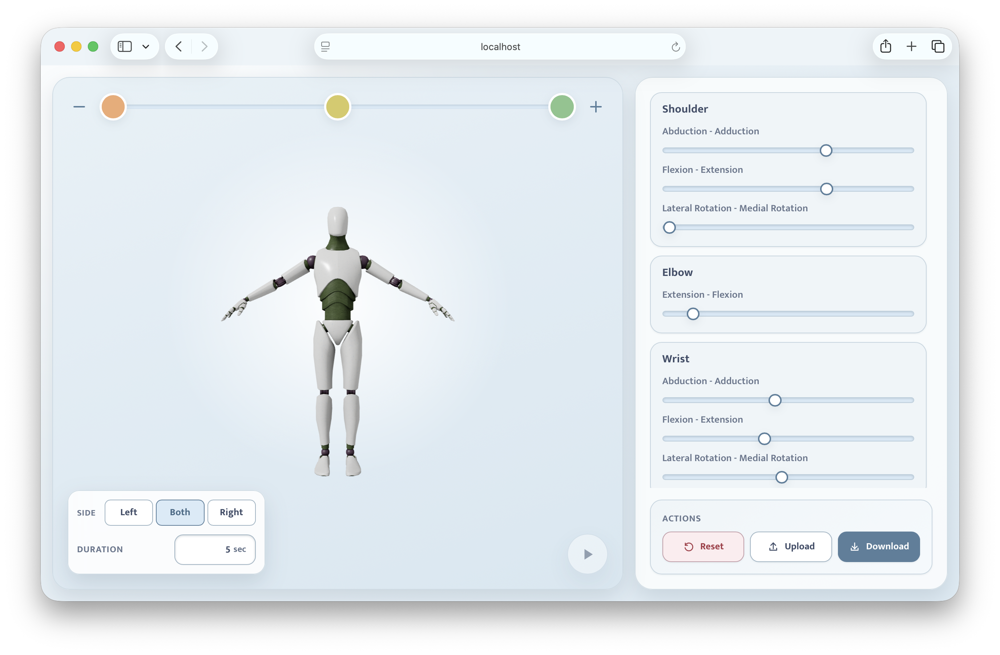

# Motion Editor

Motion Editor is a standalone, browser-based 3D movement editor. It can be used to create upper-limb movements from keyframes, preview the resulting animation, and save the exercise as an editable GLTF file.

The application does not require an API connection, backend, database, or user account. All editing takes place in the browser, and project files are saved directly to the user's device.

[Demo](https://panibo.github.io/Motion-Editor/)



## Features

- Interactive 3D viewport with orbit and zoom controls.
- Separate movement controls for the shoulder, elbow, and wrist.
- Edit the left side, right side, or both sides simultaneously.
- Create and reorder between 2 and 5 keyframes.
- Set the total animation duration from 1 to 60 seconds.
- Preview the animation directly in the editor.
- Download an exercise as a local `.gltf` file.
- Upload a previously saved Motion Editor project for further editing.
- Responsive interface for desktop and mobile screen sizes.
- No API, database, or cloud connection required.

## Getting Started

### Requirements

- Node.js
- npm
- A modern browser with WebGL enabled

### Installation

```bash
npm install
```

### Development Server

```bash
npm run dev
```

Vite prints the local address where the editor can be opened after the development server starts.

### Production Build

```bash
npm run build
```

The optimized production build is created in the `dist` directory. Preview it locally with:

```bash
npm run preview
```

## Using the Editor

1. Select a keyframe at the top of the 3D viewport.
2. Choose the side to edit from the lower-left corner:
   - **Left** edits the left side.
   - **Both** mirrors changes to both sides.
   - **Right** edits the right side.
3. Create a pose with the Shoulder, Elbow, and Wrist controls on the right.
4. Select another keyframe and create its pose.
5. Set the total animation length with the **Duration** field.
6. Preview the completed movement with the play button.

Keyframes are distributed evenly across the total animation duration.

### Managing Keyframes

- The **plus button** adds a new keyframe. The maximum is five.
- The **minus button** enables deletion mode. Select a keyframe to remove it.
- An animation requires at least two keyframes, so the final two cannot be deleted.
- Reorder keyframes by dragging one keyframe onto another.
- A highlighted ring indicates the currently selected keyframe.

### Navigating the 3D View

- Drag with the mouse to orbit around the model.
- Zoom with the mouse wheel or trackpad gesture.
- The play button becomes available after the keyframes required for an animation contain saved poses.

## Saving and Opening Projects

### Download

1. Select **Download**.
2. Enter a name for the exercise.
3. Confirm the download.

The browser saves the exercise as a JSON-based `.gltf` file containing:

- The 3D model and generated animation
- The total animation duration
- Keyframe order and joint poses
- Left- and right-side control values
- The selected editing side

Editable project data is stored as versioned GLTF metadata under `extras.motionEditor`.

### Upload

Select **Upload** to open a `.gltf` file previously downloaded from this editor. The project is restored with its keyframes, control values, editing side, and animation duration.

A regular GLTF file without Motion Editor metadata is rejected with a clear error message. Uploaded files are not sent over the network.

> The editor does not provide automatic cloud saving. Keep the downloaded GLTF file if you want to continue editing the exercise later.

## Project Structure

```text
Editor/
├── docs/
│   └── editor-preview.png
├── public/
│   └── models/                 # Puppet model, skeleton, and textures
├── src/
│   ├── components/             # Reusable React UI and 3D components
│   ├── controllers/            # Joint, animation, and GLTF file logic
│   ├── json/                   # Default values and control limits
│   ├── styles/                 # Shared tokens and component styles
│   ├── views/Editor.jsx        # Main editor view and application state
│   ├── App.jsx
│   └── main.jsx
├── index.html
├── package.json
└── vite.config.js
```

## Technology

- [React](https://react.dev/)
- [Vite](https://vite.dev/)
- [Three.js](https://threejs.org/)
- [React Three Fiber](https://r3f.docs.pmnd.rs/)
- [Drei](https://drei.docs.pmnd.rs/)
- [Oxlint](https://oxc.rs/docs/guide/usage/linter.html)

## Available Scripts

| Command | Description |
| --- | --- |
| `npm run dev` | Starts the Vite development server. |
| `npm run lint` | Checks JavaScript and JSX with Oxlint. |
| `npm run build` | Creates an optimized production build. |
| `npm run preview` | Previews the production build locally. |

## Privacy

The editor has no application backend. Movements, names, and uploaded projects are processed locally in the user's browser. Project data is not sent to an API or database.

The current implementation loads Google Fonts from Google's servers when the page opens. Host the fonts locally if the application must work without any network connection.

## License and Attribution

See [LICENSE](LICENSE) for the license terms. Original sources and attribution information are listed in [ATTRIBUTION.md](ATTRIBUTION.md).
